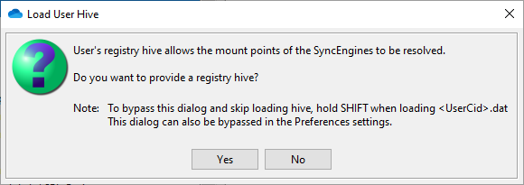
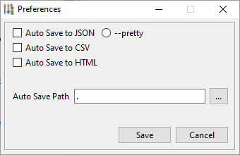
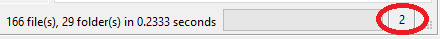
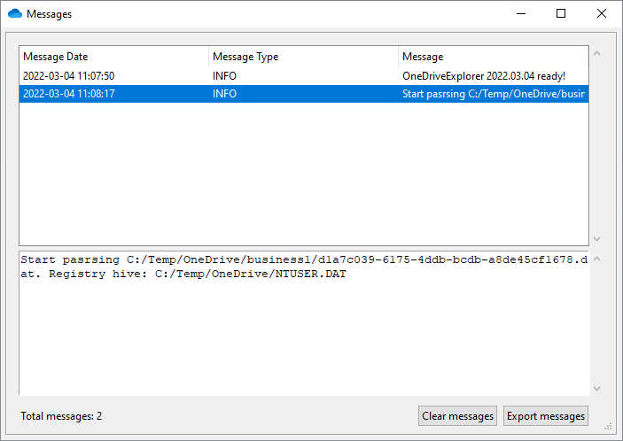
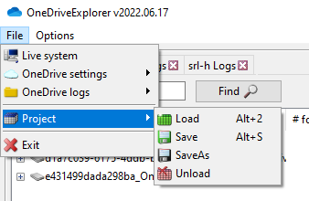
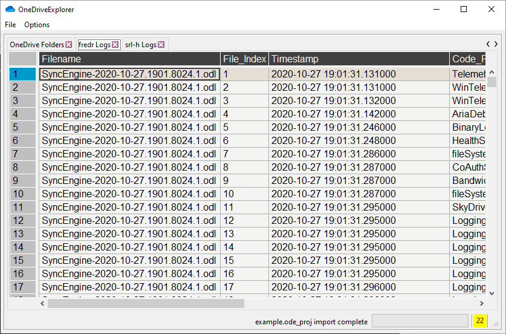

# OneDriveExplorer Summary

OneDriveExplorer is a command line and GUI based application for reconstructing the folder structure of OneDrive from `<UserCid>.dat`, `<UserCid>.dat.previous` and/or SQLite databases. Also supports parsing OneDrive logs with extensions `.odl`, `.odlgz`, `.odlsent` and `.aold`. Log parsing is heavily based on the work of Yogesh Khatri [odl.py](https://github.com/ydkhatri/OneDrive).

## Usage

Settings files are found in the following loacations:
 * \AppData\Local\Microsoft\OneDrive\settings\Business<span style="color:yellow"><1-9></span>
 * \AppData\Local\Microsoft\OneDrive\settings\Personal
 
Log files are found in the following loacations:
 * \AppData\Local\Microsoft\OneDrive\logs\Business<span style="color:yellow"><1-9></span>
 * \AppData\Local\Microsoft\OneDrive\logs\Personal
 
 Log files will be unobfuscated if the `ObfuscationStringMap.txt` and\or [`general.keystore`, `vault.keystore`] file(s) are present.

### Requirements

This project requires several additional modules. You can install them with the provided requirements.txt file as follows:

```bash
python3 -m pip install -r requirements.txt
```

<span style="color:red">**&#42;Note:** pytsk3 and quickxorhash require a compiler to install. Using the executables is recommended.</span>

### Command line


To use OneDriveExplorer, simply provide the `.\<UserCid>.dat` file to the `-f` argument

```bash
OneDriveExplorer.exe -f \AppData\Local\Microsoft\OneDrive\settings\Personal/Business<1-9>\d1a7c039-6175-4ddb-bcdb-a8de45cf1678.dat
```

Newer versions of OneDrive have switched to SQLite. Use the -s switch instead.

```bash
OneDriveExplorer.exe -s \AppData\Local\Microsoft\OneDrive\settings\Personal/Business<1-9>
```

Depending on the options, OneDriveExplorer can produce JSON, CSV, or HTML files of the parsed data. The `--pretty` option can be used to output the JSON into a more human readable layout.

A user registry hive can be supplied with the `-r` argument. This will resolve some of the mount points associated with OneDrive. Along with the registry hive, $Recycle.Bin can be added with the `-rb` option to look for deleted files.

### Example output

#### JSON


#### CVS


#### HTML


## GUI

The GUI consists of three panes: the folder structure on the left, file pane in the middle, and details on the right. By clicking on one of the entries in the left pane or file pane, the details pane will populate with various data such as name, whether it is a file or folder, UUIDs and the number of children, if any. There is also a pane on the bottom that correlates log data back to the selected item.


The GUI is capable of parsing the live system and dat/SQLite files, along with loading JSON or CSV from a previously parsed dat/SQLite file. OneDriveExplorer GUI also supports loading multiple files. When loading a dat/SQLite file, an additional dialog will appear to allow you to supply a registry file. This can be disabled by holding down `SHIFT` or disabling it in the preferences menu.

&#42;OneDrive ODL logs can be enabled in the Preferences menu.

  

Through the preferences menu, there are options available for saving the parsed dat/SQLite file to JSON, CSV, and HTML. There is also an option to disable the hive dialogue.



OneDriveExplorer GUI is also capable of performing a simple search.


There are right click menus to help perform various tasks and skin options.


The messages dialogue can be accessed by double clicking on the number in the lower right corner. From this dialogue, you can view, clear and export debug messages.




Projects can also be created to save your work without having to parse the files again. This has the advantage of loading the data more quickly.



If ODL log files are enabled, additional tabs for each users logs will be created.



## File location

The default file location of the `.dat` files are:

- Personal: `C:\Users\<USERNAME>\AppData\Local\Microsoft\OneDrive\settings\Personal\<UserCid.dat>`
- Business: `C:\Users\<USERNAME>\AppData\Local\Microsoft\OneDrive\settings\Business<1-9>\<UserCid.dat>`

## Todo
