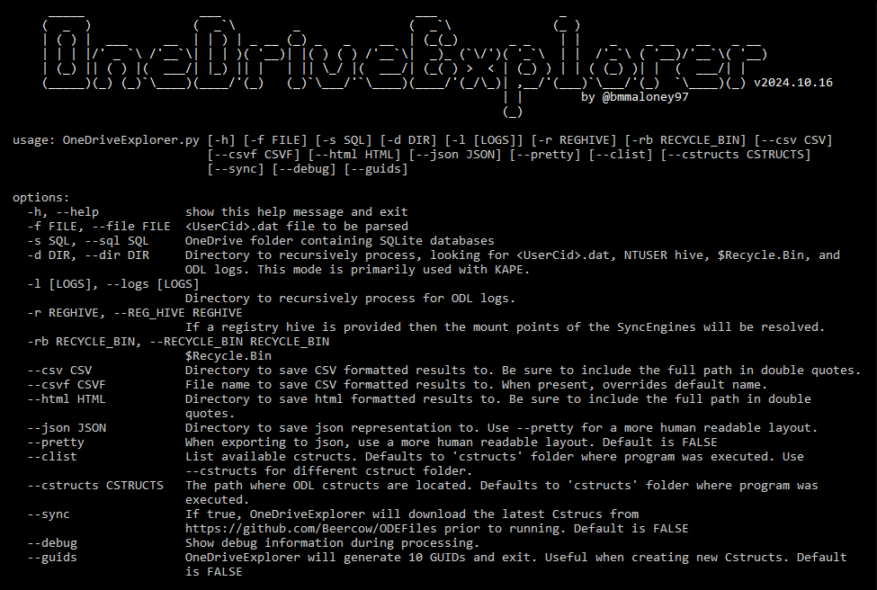

# OneDriveExplorer Summary

OneDriveExplorer is a command line and GUI based application for reconstructing the folder structure of OneDrive from the `<UserCid>.dat` and `<UserCid>.dat.previous` file.

## Usage

## Command line



To use OneDriveExporer, simply provide the `.\<UserCid>.dat` file to the `-f` argument

```bash
OneDriveExplorer.py -f business1\d1a7c039-6175-4ddb-bcdb-a8de45cf1678.dat
```

OneDriveExplorer will produce a JSON file called OneDrive.json containing the folder structure. The `--pretty` option can be used to output the JSON into a more human readable layout.


## GUI

The GUI consists of two panes: the folder structure on the left and details on the right. By clicking on one of the entries in the left pane, the details pane will populate with various data such as name, whether it is a file or folder, UUIDs and the number of children, if any.

To use the GUI, ttktheme package needs to installed. You can do this with the provided requirements.txt file as follows:

```bash
pip3 install -r requirements.txt
```


## File location

The default file location of the `.dat` files are:

- Personal: `C:\Users\<USERNAME>\AppData\Local\Microsoft\OneDrive\settings\Personal\<UserCid.dat>`
- Business: `C:\Users\<USERNAME>\AppData\Local\Microsoft\OneDrive\settings\Business1\<UserCid.dat>`

## Todo

- [x] Add support for OneDrive personal
- [x] GUI not populating correctly when opening different dat file
- [ ] Load multiple files in GUI
- [ ] Performance improvements
