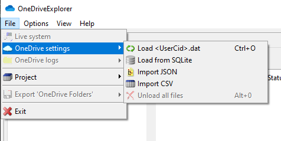
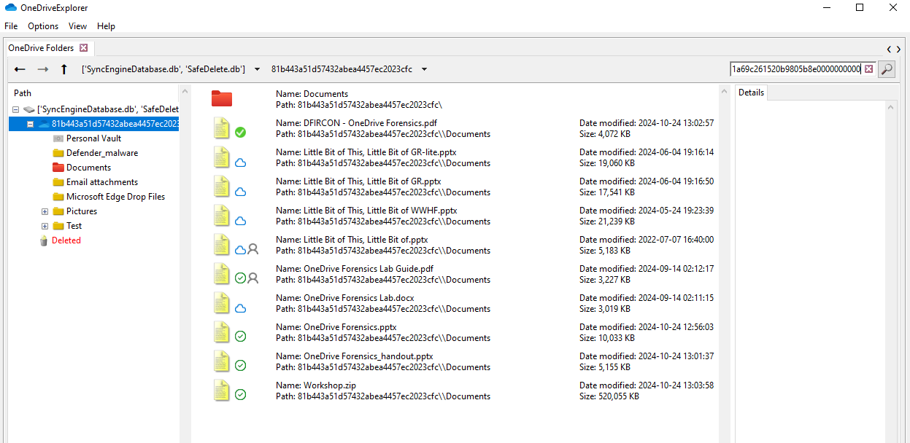
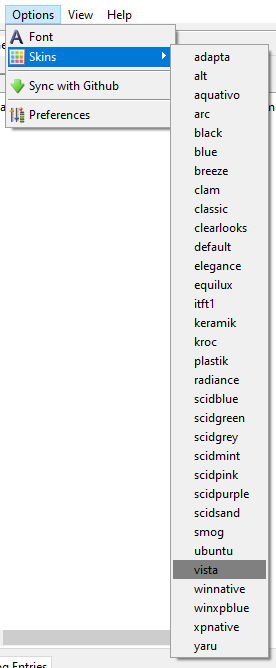

# OneDriveExplorer Summary

OneDriveExplorer is a command line and GUI based application for reconstructing the folder structure of OneDrive from the `<UserCid>.dat` and `<UserCid>.dat.previous` file.

## Usage

## Requirements

Pillow, pandas and ttktheme packages need to be installed. You can do this with the provided requirements.txt file as follows:

```bash
pip3 install -r requirements.txt
```

## Command line


To use OneDriveExporer, simply provide the `.\<UserCid>.dat` file to the `-f` argument

```bash
OneDriveExplorer.py -f business1\d1a7c039-6175-4ddb-bcdb-a8de45cf1678.dat
```

Depending on the options, OneDriveExplorer can produce JSON, CSV, or HTML files of the parsed data. The `--pretty` option can be used to output the JSON into a more human readable layout.

### Example output:

#### JSON


#### CVS


#### HTML


## GUI

The GUI consists of two panes: the folder structure on the left and details on the right. By clicking on one of the entries in the left pane, the details pane will populate with various data such as name, whether it is a file or folder, UUIDs and the number of children, if any.


The GUI is capable of parsing dat files along with loading JSON or CSV from a previously parsed dat file. OneDriveExplorer GUI also supports loading multiple files.



OneDriveExplorer GUI is also capable of performing a simple search.



There are right click menus to help perform various tasks and sin options.




## File location

The default file location of the `.dat` files are:

- Personal: `C:\Users\<USERNAME>\AppData\Local\Microsoft\OneDrive\settings\Personal\<UserCid.dat>`
- Business: `C:\Users\<USERNAME>\AppData\Local\Microsoft\OneDrive\settings\Business1\<UserCid.dat>`

## Todo

- [x] Add support for OneDrive personal
- [x] GUI not populating correctly when opening different dat file
- [x] Load multiple files in GUI
- [x] Performance improvements